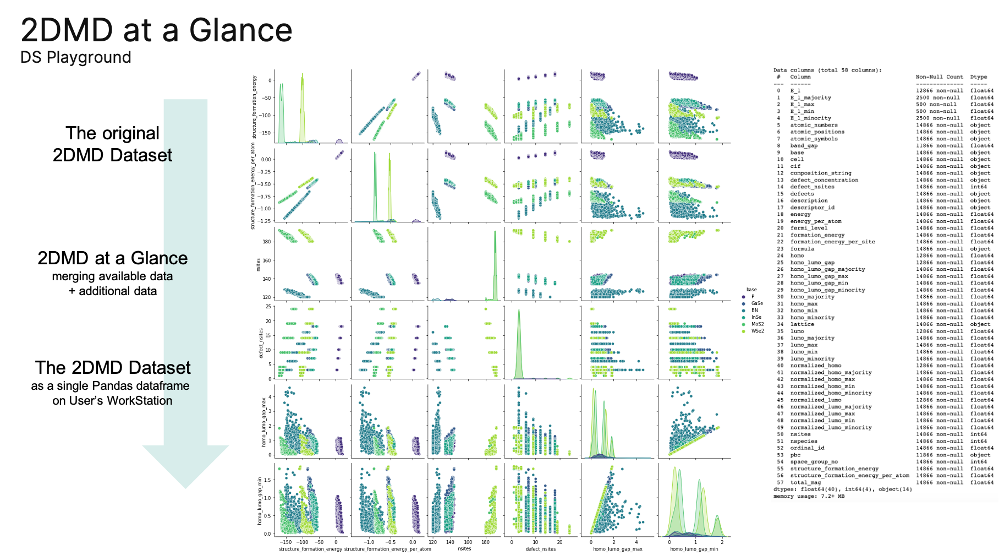

# 2DMD at a Glance: An easy access, manipulation, visualization, and analysis of dataset

## Introduction
The rational design of new materials, as well as materials with desired and remarkable properties, is one of the central problems in modern computational chemistry and theoretical materials science. 
In turn, two-dimensional (2D) materials represent an important subset of the whole library of all possible materials.
The 2D Material Defect (2DMD) [dataset](https://rolos.com/open/2d-materials-point-defects/)  was created using density functional theory (DFT) calculations to facilitate the application of machine learning methods and the development of new efficient data-driven approaches in the study and design of new 2D materials.
For more detailed information, the users are referred to the original [paper](https://www.nature.com/articles/s41699-023-00369-1).
The dataset contains the thermodynamic and electronic properties of point defects in monolayers (bases) of MoS2, WSe2, hBN, GaSe, InSe, and black phosphorus.
For the broad scientific community and non-specialists/newcomers in the field of machine learning, we present ready-made solutions for accessing DFT-derived data, visual and numerical analysis, and data manipulation tools.

## How to use
The '2DMD at a Glance' Jupyter Notebook is designed according to the functional programming paradigm to make it easier for non-programmers to interact with this piece of code.
1) The zipped version of the 2DMD dataset (5.4 MB, 2d-materials-point-defects-all.zip) will be downloaded automatically and stored in the folder from which the Jupyter Notebook "2DMD at a Glance" was started.
2) Without prior unpacking, the dataset is converted to a pandas dataframe format , allowing easy access and manipulation of the data, and saved for later use.
3) The code contains ready-made solutions for easy data access, visual and numerical analysis, and data manipulation tools.

## Library Requirements
The developed tools do not require any proprietary software. 
In addition to the Python standard library, the [NumPy](https://numpy.org/), [scikit-learn](https://scikit-learn.org), and [Pandas](https://pandas.pydata.org/) libraries are used to process and store data and provide quick and easy access. 
For plotting and statistical data visualization, the [Matplotlib](https://matplotlib.org/) and [Seaborn](https://seaborn.pydata.org/) libraries are required. 
To handle crystal structures, the [Pymatgen](https://pymatgen.org/) open-source Python library for materials analysis is used. 
For parallel running, the [JobLib](https://joblib.readthedocs.io/en/stable/) toolbox for Python is reqired.
To install (if needed), follow the installation tutorials.
